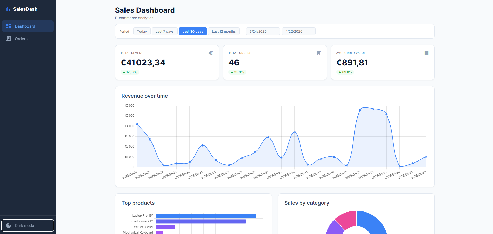
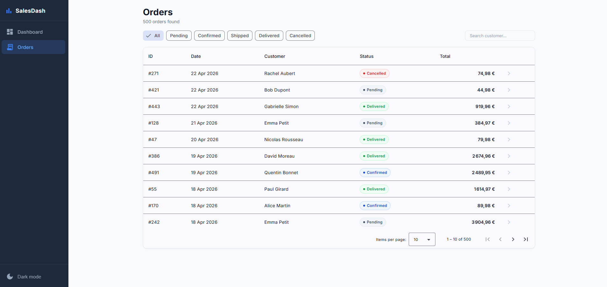
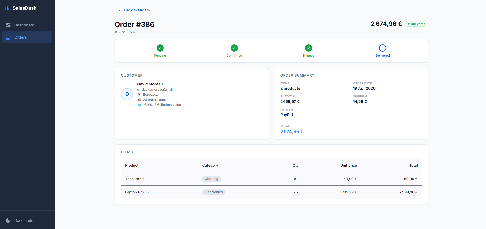

# Sales Analytics Dashboard

### [→ Live demo](https://sales-analytic-dashboard.lcp942.com)
> Auto-generated data — no setup, no account required.

---


[](https://sales-analytic-dashboard.lcp942.com)

A full-stack sales analytics dashboard.
The backend exposes aggregation and CRUD endpoints over a self-managed MySQL dataset.
The frontend renders interactive chart components driven by a reactive date-range filter.

---

## Screenshots





---

## Stack

| Layer | Technology |
|---|---|
| Frontend | Angular 21, standalone components, Signals, Angular Material, ECharts |
| Backend | Spring Boot 3.3, Java 21 Records, virtual threads |
| Database | MySQL 8.4, sliding 10-year window of auto-generated orders |
| Tests | `@DataJpaTest` (Spring), `HttpTestingController` (Angular) |
| Infra | Docker Compose (local), any container host + static host (production) |

### Key architectural signals

- **`provideHttpClient(withFetch())`** in `app.config.ts` — modern fetch-based HTTP client
- **Angular Signals** (`signal()`, `computed()`, `effect()`) for filter state and reactive chart updates
- **Java 21 Records as DTOs** — instantiated directly via JPQL constructor expressions
- **`spring.threads.virtual.enabled=true`** — Project Loom virtual threads for high concurrency
- **Functional HTTP interceptor** — global loading indicator + `MatSnackBar` error banner
- **TypeScript strict mode** — zero `any` in production code
- **Self-maintaining data** — a sliding window job keeps ±5 years of orders current indefinitely

---

## Quick start (local)

**Prerequisites:** Docker Desktop

```bash
docker compose up --build
```

Once all three containers are healthy, open [http://localhost:4200](http://localhost:4200).

What happens under the hood:
- MySQL 8.4 starts (schema is created by Hibernate on first boot)
- Spring Boot connects, seeds the product/customer catalog, then generates orders covering the last 5 years and next 5 years in the background
- Angular builds and is served by nginx on port `4200`

### Run tests

```bash
# Backend (requires Java 21)
cd backend && mvn test

# Frontend (requires Node.js 20+)
cd frontend && npm test
```

---

## Project structure

```
.
├── backend/                      # Spring Boot 3.3 / Java 21
│   └── src/main/java/.../
│       ├── entity/               # JPA entities (SalesOrder, Product, OrderItem, Customer)
│       ├── dto/                  # Java 21 Records (KpiRawDto, RevenuePointDto, …)
│       ├── repository/           # JPQL + native queries with @Param
│       ├── seeder/               # CatalogSeeder — seeds customers & products on first boot
│       ├── service/              # Aggregation logic, DataMaintenanceService (sliding window)
│       ├── scheduler/            # CleanupScheduler, DataMaintenanceScheduler (hourly)
│       └── controller/           # REST endpoints under /api/
├── frontend/                     # Angular 21 SPA
│   └── src/app/
│       ├── core/                 # Models, LoadingService, FilterService, interceptor
│       ├── dashboard/            # DashboardComponent + chart components + service
│       ├── orders/               # Orders list and detail
│       ├── customers/            # Customers list and detail
│       └── shared/               # FilterStrip, SkeletonLoader, reusable components
├── docker/mysql/my.cnf           # MySQL charset config
├── docker-compose.yml
└── railway.json                  # Example production deploy config
```

---

## Data model

The app manages two kinds of data:

| Flag | Created by | Lifetime |
|---|---|---|
| `user_created = false` | App on startup / hourly batch | Managed automatically |
| `user_created = true` | User via the UI | Cleaned up every 12 hours |

The batch (`DataMaintenanceService`) maintains a ±5 years sliding window of orders at all times.
On each hourly run, a single `SELECT MAX(order_date)` query determines whether anything needs doing — most runs exit immediately.
The window size is configurable via `app.seeder.window-years` in `application.properties`.

---

## API endpoints

All stats endpoints accept `?from=YYYY-MM-DD&to=YYYY-MM-DD`.

| Method | Path | Description |
|---|---|---|
| GET | `/api/stats/kpis` | Revenue, orders, avg. order value + % delta vs previous period |
| GET | `/api/stats/revenue-over-time` | Revenue time series (auto granularity: day / week / month) |
| GET | `/api/stats/orders-over-time` | Order count time series |
| GET | `/api/stats/top-products` | Top 10 products by revenue |
| GET | `/api/stats/orders-by-category` | Item count per product category |
| GET | `/api/orders` | Paginated order list with filters |
| GET | `/api/orders/{id}` | Order detail with items |
| POST | `/api/orders` | Create an order |
| GET | `/api/customers` | Paginated customer list |
| GET | `/api/customers/{id}` | Customer detail |
| POST | `/api/customers` | Create a customer |

---

## Deployment

The app has two independent deployable units:

### Backend

The backend is a standard Spring Boot JAR packaged as a Docker image (`backend/Dockerfile`).
It requires:
- A **MySQL 8.4** database (the schema is created automatically on first boot via `ddl-auto=update`)
- The following **environment variables**:

  | Variable | Description |
  |---|---|
  | `DATABASE_URL` | JDBC URL — `jdbc:mysql://<host>:<port>/sales_dashboard` |
  | `DATABASE_USER` | Database username |
  | `DATABASE_PASSWORD` | Database password |
  | `CORS_ORIGINS` | Comma-separated list of allowed frontend origins |

No manual SQL import needed — the app seeds its own catalog and generates orders on first boot.

Deploy on any platform that can run a Docker container or a JVM: Railway, Fly.io, Render, a plain VPS, etc.

### Frontend

The frontend is a static Angular SPA built with `npm run build` (output: `frontend/dist/sales-dashboard/browser`).

Before building for production, set the backend URL in `frontend/src/environments/environment.prod.ts`:

```ts
export const environment = {
  production: true,
  apiBaseUrl: 'https://your-backend-url/api',
};
```

The SPA requires a **catch-all rewrite** so that all paths serve `index.html` (Angular handles routing client-side). Example for nginx:

```nginx
location / {
  try_files $uri $uri/ /index.html;
}
```

A `vercel.json` with the equivalent rewrite rule is already included for convenience.

Deploy on any static host: Vercel, Netlify, Cloudflare Pages, S3 + CloudFront, a plain nginx server, etc.

---

## License

MIT
